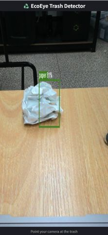
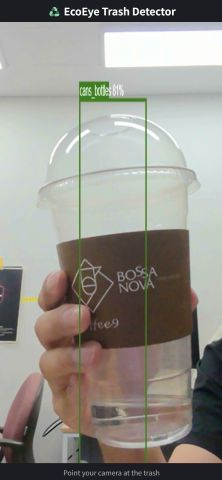

# ♻️ EcoEye (실시간 쓰레기 분리수거 보조 웹 앱)

<br>

>  

<br>

## 📌 프로젝트 소개

**EcoEye**는 스마트폰의 웹 브라우저를 통해 **실시간으로 쓰레기 분리수거 오류를 탐지**하는 **모바일 웹 애플리케이션**입니다. 별도의 앱 설치 없이 웹사이트에 접속하기만 하면, 카메라에 비춰진 쓰레기를 AI가 즉시 인식하고 분류 결과를 화면에 보여줍니다.

최신 객체 탐지 모델인 **YOLOv8**을 웹 환경에 최적화된 **TensorFlow.js** 포맷으로 변환하여 사용자의 브라우저 내에서 직접 실행(On-device AI)합니다. '일반쓰레기', '캔·병', '종이'로 구분된 쓰레기를 카메라로 비추면, AI가 실시간으로 객체의 종류와 위치를 식별하여 올바른 분리배출을 유도합니다.

본 프로젝트는 복잡한 분리수거 과정을 더 쉽고 정확하게 만들어 재활용 효율성을 높이고, 나아가 환경 보호에 기여하는 것을 목표로 합니다.

<br>

## ✨ 주요 기능

  * **웹 기반 실시간 탐지**: 스마트폰 웹 브라우저에서 바로 쓰레기 객체를 실시간으로 탐지합니다. **(앱 설치 불필요)**
  * **3종 쓰레기 분류**: **종이(paper)**, **캔·병(cans\_bottles)**, **일반쓰레기(general\_waste)** 3가지 클래스를 구분합니다.
  * **결과 시각화**: 탐지된 객체 위치에 **바운딩 박스(Bounding Box)**를 그리고, **클래스 이름**과 **신뢰도 점수**를 명확하게 표시합니다.
  * **웹 최적화**: 경량화된 **TensorFlow.js (TF.js)** 모델과 **WebGL 가속**을 사용하여 모바일 브라우저에서도 빠르고 효율적으로 동작합니다.

<br>

## 🛠️ 기술 스택 및 개발 과정

### 🤖 AI 모델 개발

  * **Model**: **YOLOv8s** (Small 버전)
  * **Framework**: **PyTorch**, **Ultralytics** (모델 학습 및 평가)
  * **Training Environment**: **Google Colab** (클라우드 GPU 활용)
  * **Dataset**: 웹 크롤링 및 직접 촬영을 통해 구축한 **커스텀 쓰레기 이미지 데이터셋** (약 1,500+ 이미지)
  * **Annotation Tool**: **Roboflow** (데이터 라벨링, Train/Valid/Test 분할, 데이터 증강)
  * **Web Conversion**: **TensorFlow.js Converter** (PyTorch 모델 → TF.js Graph Model 변환)

### 📱 모바일 애플리케이션

  * **Platform**: **Web (Mobile First)**
  * **Framework/Library**: **React (v18)**, **TypeScript**
  * **Build Tool**: **Vite**
  * **Core Libraries**:
      * **TensorFlow.js (TF.js)**: 웹 브라우저 내(On-device)에서 AI 모델 추론 실행 (WebGL 백엔드 활용)
      * **WebRTC (`getUserMedia`)**: 실시간 카메라 영상 스트림 접근
      * **Canvas**: 탐지 결과(바운딩 박스, 라벨) 시각화
      * **requestAnimationFrame**: 실시간 추론 루프 구현
      * **CSS3**: UI 스타일링 및 레이아웃 (Flexbox 활용)

### 🔄 개발 워크플로우

1.  **데이터 수집**: 다양한 환경(조명, 각도, 배경)에서 '일반쓰레기', '캔·병', '종이' 이미지 데이터 확보 (직접 촬영 + 웹 크롤링)
2.  **데이터 라벨링 및 전처리**: Roboflow를 사용하여 객체 바운딩 박스 Annotation, 데이터셋 분할 및 증강 적용
3.  **모델 학습**: Google Colab 환경에서 사전 학습된 YOLOv8s 모델을 커스텀 데이터셋으로 Fine-tuning
4.  **성능 평가 및 개선**: 학습된 모델의 mAP, Precision, Recall을 평가. 예측 실패 사례 분석 후 데이터 보강 및 재학습 반복 (최종 mAP50: 93.1%)
5.  **모델 변환 및 최적화**: 학습 완료된 PyTorch 모델(`.pt`)을 **TensorFlow.js Graph Model(`model.json` + `.bin`)** 포맷으로 변환. **INT8 양자화**를 적용하여 모델 크기를 약 50% 줄이고 추론 속도 향상
6.  **웹 앱 개발 및 통합**: React와 TypeScript로 UI 컴포넌트 개발. `getUserMedia`로 카메라 영상 <video>에 연결. `requestAnimationFrame` 루프 내에서 TF.js 모델로 실시간 추론 실행. 추론 결과를 후처리(NMS)하여 `<canvas>`에 시각화

<br>

## 🚀 실행 방법

1.  본 GitHub 저장소를 `clone` 받습니다.
    ```bash
    git clone https://github.com/02hyeok/ecoeye.git
    cd ecoeye
    ```
2.  필요한 라이브러리를 설치합니다.
    ```bash
    npm install
    # 또는 yarn install
    ```
3.  `public/web_model` 폴더에 변환된 TensorFlow.js 모델 파일들(`model.json`, `*.bin`)이 있는지 확인합니다.
4.  개발 서버를 실행합니다.
    ```bash
    npm run dev
    # 또는 yarn dev
    ```
5.  PC 테스트: 웹 브라우저에서 터미널에 출력된 `Local:` 주소 (예: `http://localhost:5173`)로 접속합니다. (웹캠 필요)
6.  모바일 테스트:

    * 같은 Wi-Fi에 연결된 스마트폰 브라우저에서 터미널에 출력된 `Network:` 주소 (예: `http://192.168.x.x:5173`)로 접속합니다.
    * 주의: 카메라(`getUserMedia`)는 `localhost` 또는 `https` 환경에서만 작동합니다. 로컬 네트워크 IP(`http://...`)에서는 카메라가 켜지지 않을 수 있습니다.
    * 해결: `ngrok`과 같은 터널링 도구를 사용하여 `https` 주소를 생성 (`ngrok http 5173`)하고, 스마트폰에서 해당 `https` 주소로 접속하여 테스트하는 것을 권장합니다.

<br>

## 📈 향후 개선 과제

  * **분류 클래스 확장**: 플라스틱(PET, PP, PS 등), 비닐, 유리, 스티로폼 등 더 세분화된 쓰레기 종류 추가 학습
  * **모델 성능 고도화**: 더 많은 데이터(특히 탐지가 어려운 예외 상황) 확보 및 다양한 Augmentation 기법 적용, 하이퍼파라미터 튜닝
  * **사용자 피드백 강화**: 잘못된 분리수거 시 명확한 경고 표시 및 올바른 배출 방법 안내 기능 추가
  * **PWA(Progressive Web App) 전환**: 오프라인 지원, 홈 화면 아이콘 추가 등 네이티브 앱과 유사한 사용 경험 제공 고려
